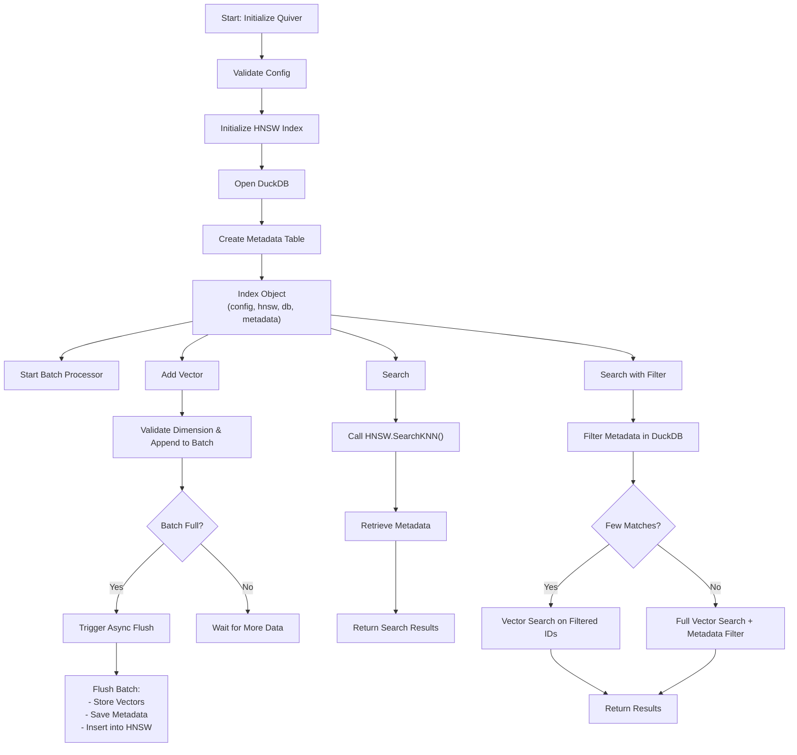

Blazing-Fast, Embeddable, Structured Vector Search in Go

[](https://goreportcard.com/report/github.com/TFMV/quiver)
[](https://pkg.go.dev/github.com/TFMV/quiver)

## 🏗 Architecture

Quiver is a lightweight, high-performance vector search engine designed for structured datasets that uses HNSW for efficient vector indexing and DuckDB for metadata storage.



## 📦 Example Usage

Please note that Quiver uses zap for logging. Callers are responsible for providing a logger.

```go
// Initialize Quiver
index, _ := quiver.New(quiver.Config{
    Dimension: 128, StoragePath: "data.db", MaxElements: 10000,
}, testLogger)

// Insert a vector
vector := []float32{0.1, 0.2, 0.3, ...}
index.Add(1, vector, map[string]interface{}{"category": "science"})

// Perform a search
results, _ := index.Search(vector, 5)
fmt.Println("Closest match:", results[0].ID, results[0].Metadata)

// Save the index to disk
index.Save("index.quiver")

// Load the index from disk
index, _ = quiver.Load("index.quiver")

// Perform a hybrid search with metadata filter
filteredResults, _ := index.SearchWithFilter(vector, 5, "category = 'science'")
fmt.Println("Filtered results:", filteredResults)

// Close the index
index.Close()
```

## 🌟 Features

- **High-Performance**: Utilizes HNSW for efficient vector indexing
- **Structured Data**: Supports metadata storage for structured datasets
- **Lightweight**: Minimal dependencies, easy to embed in your Go applications
- **Flexible**: Supports various distance metrics (e.g., Euclidean, Cosine)
- **Configurable**: Customize HNSW parameters for optimal performance

## 🚀 Performance

The following benchmarks were performed on a 2023 MacBook Pro with an M2 Pro CPU:

| Operation | Throughput | Latency | Memory/Op | Allocs/Op |
|-----------|------------|---------|-----------|------------|
| Add | 5.5K ops/sec | 3.2ms | 1.4 KB | 21 |
| Search | 28.8K ops/sec | 41µs | 1.5 KB | 18 |
| Hybrid Search | 2.5K ops/sec | 432µs | 7.5 KB | 278 |
| Add Parallel | 4.5K ops/sec | 5.3ms | 1.3 KB | 20 |
| Arrow Append* | 100 ops/sec | 2.7s | 2.3 MB | 32,332 |

Benchmark configuration:

- Vector dimension: 128
- Dataset size: 10,000 vectors
- HNSW M: 32
- HNSW efConstruction: 200
- HNSW efSearch: 200
- Batch size: 1,000
- Storage: In-memory DuckDB

*Note: Arrow Append processes 1,000 vectors per operation, making its effective throughput ~100K vectors/sec.

Key observations:

- Super-fast Search 🏹 → 41µs/query
- Hybrid search (with metadata filtering) adds only ~390µs overhead
- Parallel adds achieve ~4.5K concurrent insertions/sec
- Arrow batch insertions provide highest throughput for bulk loading
