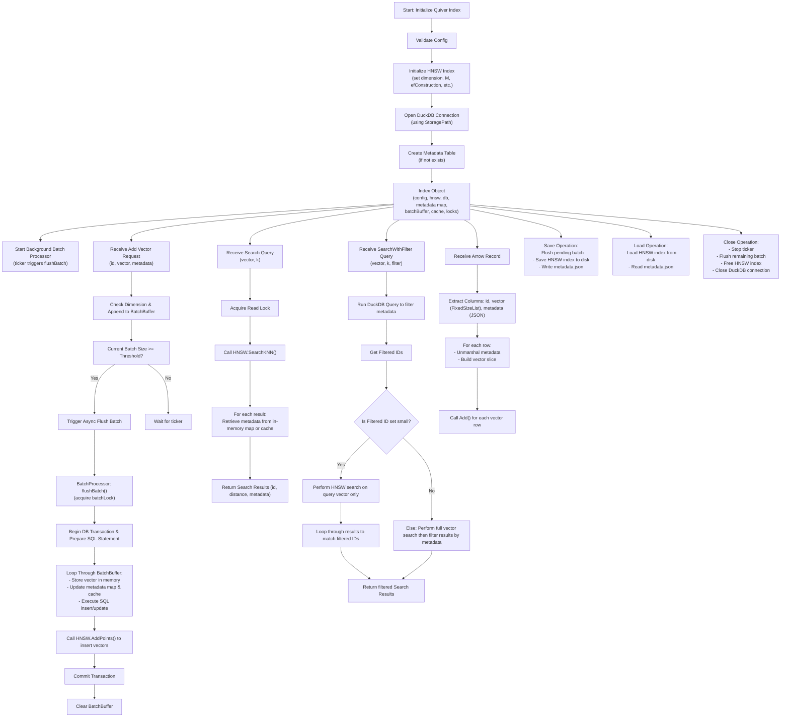

# Quiver

Blazing-Fast, Embeddable, Structured Vector Search in Go

## 🚀 Overview

Quiver is a lightweight, high-performance vector search engine designed for structured datasets.

## 🏗 Architecture

Quiver uses HNSW for efficient vector indexing and DuckDB for metadata storage.

## 🌟 Features

- **High-Performance**: Utilizes HNSW for efficient vector indexing
- **Structured Data**: Supports metadata storage for structured datasets
- **Lightweight**: Minimal dependencies, easy to embed in your Go applications
- **Flexible**: Supports various distance metrics (e.g., Euclidean, Cosine)
- **Configurable**: Customize HNSW parameters for optimal performance

## :small_airplane: Performance

The following benchmarks were performed on a 2024 MacBook Pro with an M2 Pro CPU.

| Operation | Operations/sec | Latency | Memory (B/op) | Allocations (allocs/op) |
|-----------|---------------|--------------|---------------|------------------------|
| Add | 4,872 | 3.178ms | 1,389 | 21 |
| Search | 30,246 | 44.338µs | 1,520 | 18 |
| Hybrid Search | 2,395 | 431.622µs | 7,533 | 278 |
| Add Parallel | 2,850 | 6.088ms | 1,282 | 19 |
| Arrow Append | 100 | 2.770s | 2,336,470 | 32377 |

Benchmark details:

- Vector dimension: 128
- Dataset size: 10,000 vectors
- HNSW M: 32
- HNSW efConstruction: 200
- HNSW efSearch: 200
- Batch size: 1,000

Benchmark notes:

- Arrow Append is a one-time operation that pre-allocates memory for the entire dataset.
- The other benchmarks are for typical insert/search operations.
