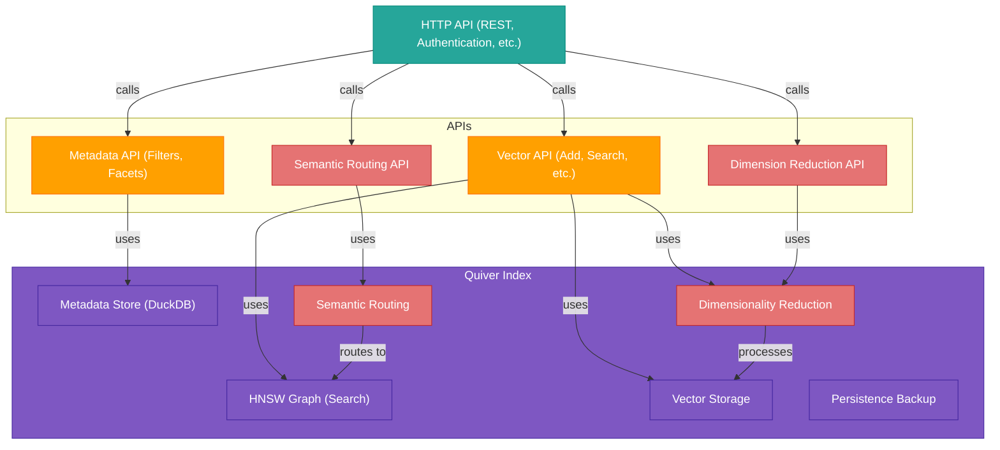
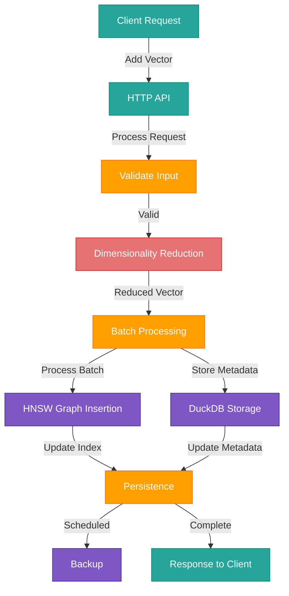
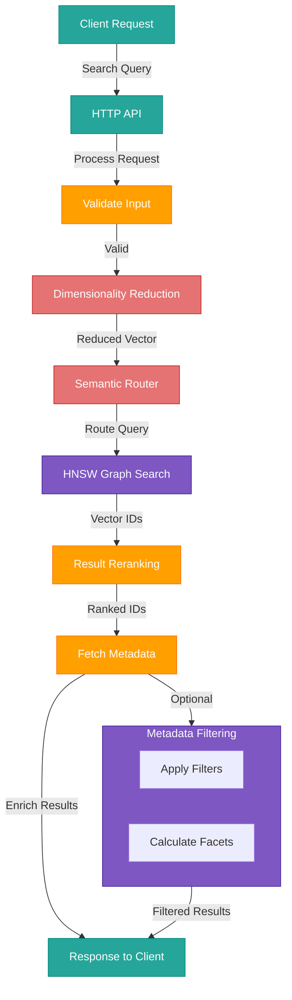
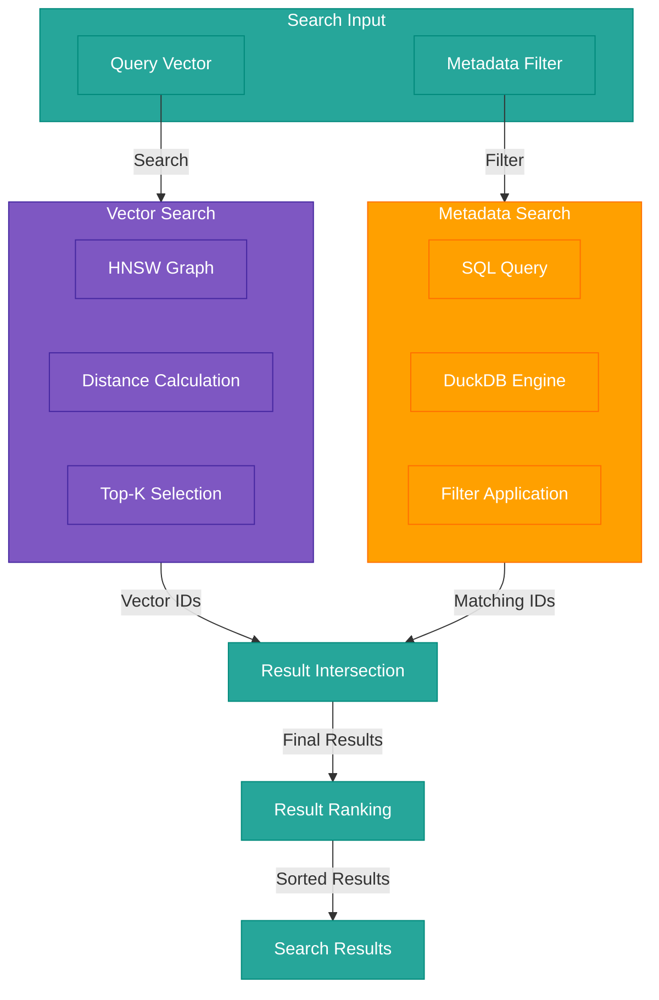

# Quiver

Quiver is a blazing-fast, embeddable vector database built in Go. It provides efficient similarity search for high-dimensional vectors with support for metadata filtering and seamless integration with Apache Arrow.

[](https://github.com/TFMV/quiver/actions/workflows/go.yml)
[](https://goreportcard.com/report/github.com/TFMV/quiver)
[](https://pkg.go.dev/github.com/TFMV/quiver)
[](https://github.com/TFMV/quiver/releases)
[](https://golang.org/doc/go1.24)
[](https://opensource.org/licenses/MIT)

## Key Features

Quiver offers a comprehensive set of features designed for production environments:

- **High-Performance Vector Search**
  - HNSW algorithm for efficient approximate nearest neighbor search
  - Multiple distance metrics (Cosine, L2)
  - Optimized with SIMD acceleration

- **Rich Metadata Support**
  - DuckDB integration for structured data
  - SQL-based filtering and faceted search
  - Schema validation for metadata consistency

- **Advanced Search Capabilities**
  - Hybrid search combining vector similarity with metadata filtering
  - Negative examples to avoid specific regions in vector space
  - Multi-vector search for complex queries

- **Enterprise-Ready**
  - Automatic backup and restore with rotation
  - Data encryption at rest with AES-GCM
  - Comprehensive monitoring and metrics

- **Performance Optimizations**
  - Batched operations for improved throughput
  - Background persistence to avoid blocking operations
  - Dimensionality reduction for storage and performance efficiency
  - Semantic routing for distributed deployments

## Architecture

Quiver combines several powerful components to deliver high-performance vector search:



## Quick Start

Getting started with Quiver is straightforward:

```go
package main

import (
    "fmt"
    "time"
    "github.com/TFMV/quiver"
    "go.uber.org/zap"
)

func main() {
    // Create a logger
    logger, _ := zap.NewDevelopment()
    
    // Initialize Quiver
    idx, err := quiver.New(quiver.Config{
        Dimension:       128,
        StoragePath:     "./data.db",
        MaxElements:     100000,
        HNSWM:           16,
        HNSWEfConstruct: 200,
        HNSWEfSearch:    100,
        BatchSize:       1000,
        Distance:        quiver.Cosine,
        // Optional: enable encryption
        EncryptionEnabled: true,
        EncryptionKey:     "your-secret-key-at-least-32-bytes-long",
        // Optional: enable scheduled backups
        BackupInterval:    1 * time.Hour,
        BackupPath:        "./backups",
        BackupCompression: true,
        MaxBackups:        5,
    }, logger)
    if err != nil {
        panic(err)
    }
    defer idx.Close()
    
    // Add vectors with metadata
    vector := []float32{0.1, 0.2, 0.3, /* ... */}
    err = idx.Add(1, vector, map[string]interface{}{
        "category": "science",
        "name":     "example",
        "tags":     []string{"tag1", "tag2"},
    })
    
    // Simple vector search
    results, _ := idx.Search(vector, 10, 1, 10)
    fmt.Println("Top match:", results[0].ID, results[0].Metadata)
    
    // Hybrid search with metadata filter
    filteredResults, _ := idx.SearchWithFilter(vector, 5, "category = 'science'")
    
    // Search with negative examples
    negativeExamples := [][]float32{{0.5, 0.6, 0.7, /* ... */}}
    negResults, _ := idx.SearchWithNegatives(vector, negativeExamples, 10, 1, 10)
}
```

## Data Flow

### Adding Vectors

When adding vectors to Quiver, the data flows through several components:



### Searching Vectors

The search process involves multiple steps to ensure efficient and accurate results:



## Advanced Features

### Hybrid Search

Quiver's hybrid search combines vector similarity with metadata filtering:



---

```go
// Search for similar vectors with metadata constraints
results, err := idx.SearchWithFilter(
    queryVector,
    10,  // number of results
    "SELECT * FROM metadata WHERE json->>'category' = 'electronics' AND json->>'price'::float < 1000"
)
```

### Dimensionality Reduction

Reduce storage requirements and improve performance with dimensionality reduction:

```go
config := quiver.Config{
    Dimension: 768,
    // Enable dimensionality reduction
    EnableDimReduction: true,
    DimReductionMethod: "PCA",
    DimReductionTarget: 128,
    // Optional: adaptive dimensionality reduction
    DimReductionAdaptive: true,
    DimReductionMinVariance: 0.95,
}
```

### Backup and Restore

Ensure data safety with automatic backups:

```go
// Configure automatic backups
config := quiver.Config{
    BackupInterval: 1 * time.Hour,
    BackupPath: "./backups",
    BackupCompression: true,
    MaxBackups: 5,
}

// Manual backup
err := idx.Backup("/path/to/backup", false, true)  // path, incremental, compress

// Restore from backup
err := idx.Restore("/path/to/backup")
```

## API Server

Quiver includes a ready-to-use HTTP API server:

```go
package main

import (
    "log"
    "github.com/TFMV/quiver"
    "github.com/TFMV/quiver/api"
    "go.uber.org/zap"
)

func main() {
    logger, _ := zap.NewDevelopment()
    
    idx, err := quiver.New(quiver.Config{
        Dimension:       384,
        StoragePath:     "./data",
        MaxElements:     100000,
        HNSWM:           16,
        HNSWEfConstruct: 200,
        HNSWEfSearch:    100,
        BatchSize:       1000,
        Distance:        quiver.Cosine,
    }, logger)
    if err != nil {
        log.Fatalf("Failed to create index: %v", err)
    }
    defer idx.Close()
    
    server := api.NewServer(api.ServerOptions{
        Port:    "8080",
        Prefork: false,
    }, idx, logger)
    
    // Start server with TLS
    // server.StartTLS("server.crt", "server.key")
    
    // Or start without TLS
    server.Start()
}
```

## Command Line Interface

Quiver comes with a comprehensive command-line interface (CLI) that provides tools for both running the server and managing vector databases. The CLI offers a unified experience for all Quiver operations.

### Installation

Build the CLI from source:

```bash
# Clone the repository
git clone https://github.com/TFMV/quiver.git
cd quiver

# Build the CLI
go build -o quiver ./cmd/main.go

# Move to a directory in your PATH (optional)
sudo mv quiver /usr/local/bin/
```

### Available Commands

The Quiver CLI includes the following commands:

**Server Management:**

- `serve`: Start the Quiver server
- `status`: Check if the Quiver server is running

**Database Operations:**

- `info`: Display information about the index
- `stats`: Show statistics about the index
- `benchmark`: Run performance benchmarks
- `optimize`: Optimize the index for better performance
- `health`: Check the health of the index

**Data Management:**

- `import`: Import vectors and metadata from a file
- `export`: Export index metadata to a file
- `backup`: Create a backup of the index
- `restore`: Restore the index from a backup
- `validate`: Validate a configuration file

### Examples

**Starting the server:**

```bash
# Start with default configuration
quiver serve

# Start with a custom configuration file
quiver serve --config my-config.yaml

# Start with a specific index path
quiver serve --index /path/to/index
```

**Managing the database:**

```bash
# Get information about the index
quiver info --index /path/to/index

# Show statistics
quiver stats

# Run benchmarks
quiver benchmark

# Create a backup
quiver backup /path/to/backup

# Restore from backup
quiver restore /path/to/backup

# Check server status
quiver status
```

**Working with data:**

```bash
# Export metadata to a file
quiver export metadata.json

# Import vectors and metadata
quiver import vectors.json

# Validate a configuration file
quiver validate config.json
```

### Configuration

The CLI can be configured using a YAML configuration file. By default, it looks for `config.yaml` in the current directory, but you can specify a different file with the `--config` flag.

Example configuration file:

```yaml
server:
  port: 8080

index:
  dimension: 128
  storage_path: "quiver.db"
  max_elements: 100000
  hnsw_m: 32
  ef_construction: 200
  ef_search: 200
  batch_size: 1000
  distance: 0  # 0 for Cosine, 1 for L2
```

### Global Flags

The following flags are available for all commands:

- `--config`: Specify a configuration file
- `--index, -i`: Specify the index path (overrides the config file)
- `--verbose, -v`: Enable verbose output
- `--help, -h`: Show help for a command

## Performance

Quiver is designed for high performance. Here are benchmark results on an M2 Pro CPU:

| Operation | Throughput | Latency | Memory/Op | Allocs/Op |
|-----------|------------|---------|-----------|-----------|
| Add | 6.4K ops/sec | 156µs | 20.9 KB | 370 |
| Search | 16.9K ops/sec | 59µs | 24.2 KB | 439 |
| Hybrid Search | 4.8K ops/sec | 208µs | 80.6 KB | 822 |
| Search with Negatives | 7.9K ops/sec | 126µs | 32.5 KB | 491 |
| Batch Add (1000) | 6.6 ops/sec | 152ms | 19.0 MB | 331K |

Key observations:

- Super-fast vector search at ~59µs per query
- Hybrid search adds minimal overhead for metadata filtering
- Efficient memory usage with configurable parameters
- Batch operations provide high throughput for bulk loading

## Installation

```bash
go get github.com/TFMV/quiver
```

## Documentation

For comprehensive documentation, visit our [Documentation Site](https://tfmv.github.io/quiver/).

## License

[MIT License](LICENSE)
