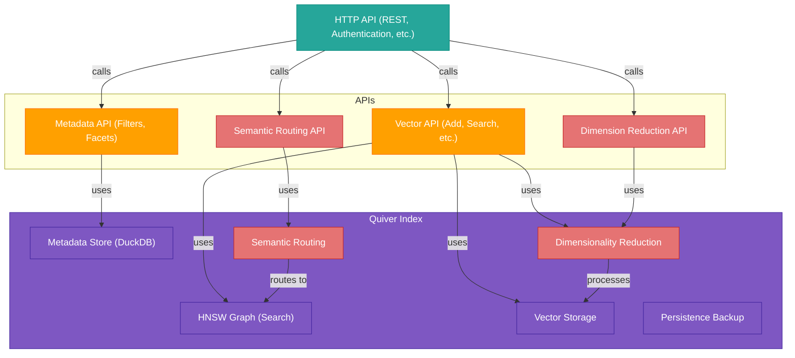

# Quiver

## High-Performance Vector Database for Go

Quiver is a blazing-fast, embeddable vector database built in Go. It provides efficient similarity search for high-dimensional vectors with support for metadata filtering and seamless integration with Apache Arrow.

[](https://github.com/TFMV/quiver/actions/workflows/go.yml)
[](https://goreportcard.com/report/github.com/TFMV/quiver)
[](https://pkg.go.dev/github.com/TFMV/quiver)
[](https://github.com/TFMV/quiver/releases)
[](https://golang.org/doc/go1.24)
[](https://opensource.org/licenses/MIT)

## 🚀 Key Features

- **High-Performance Vector Search**: Powered by HNSW algorithm for approximate nearest neighbor search
- **Rich Metadata Support**: DuckDB integration for structured data and advanced filtering
- **Optimized for Production**:
  - Batched operations for improved throughput
  - Background persistence to avoid blocking operations
  - Automatic recovery mechanisms
- **Enterprise-Ready**:
  - Backup and restore capabilities
  - Data encryption at rest
  - Comprehensive monitoring

## 🏗 Architecture

Quiver combines HNSW for efficient vector indexing with DuckDB for metadata storage:



## 📦 Quick Start

```go
package main

import (
    "fmt"
    "time"
    "github.com/TFMV/quiver"
    "go.uber.org/zap"
)

func main() {
    // Create a logger
    logger, _ := zap.NewDevelopment()
    
    // Initialize Quiver
    idx, err := quiver.New(quiver.Config{
        Dimension:       128,
        StoragePath:     "./data.db",
        MaxElements:     100000,
        HNSWM:           16,
        HNSWEfConstruct: 200,
        HNSWEfSearch:    100,
        BatchSize:       1000,
        Distance:        quiver.Cosine,
        // Optional: enable encryption
        EncryptionEnabled: true,
        EncryptionKey:     "your-secret-key-at-least-32-bytes-long",
        // Optional: enable scheduled backups
        BackupInterval:    1 * time.Hour,
        BackupPath:        "./backups",
        BackupCompression: true,
        MaxBackups:        5,
    }, logger)
    if err != nil {
        panic(err)
    }
    defer idx.Close()
    
    // Add vectors with metadata
    vector := []float32{0.1, 0.2, 0.3, /* ... */}
    err = idx.Add(1, vector, map[string]interface{}{
        "category": "science",
        "name":     "example",
        "tags":     []string{"tag1", "tag2"},
    })
    
    // Simple vector search
    results, _ := idx.Search(vector, 10, 1, 10)
    fmt.Println("Top match:", results[0].ID, results[0].Metadata)
    
    // Hybrid search with metadata filter
    filteredResults, _ := idx.SearchWithFilter(vector, 5, "category = 'science'")
    
    // Search with negative examples
    negativeExamples := [][]float32{{0.5, 0.6, 0.7, /* ... */}}
    negResults, _ := idx.SearchWithNegatives(vector, negativeExamples, 10, 1, 10)
}
```

## 🌟 Advanced Features

### Vector Operations

- **Multiple Distance Metrics**: L2 (Euclidean) and Cosine similarity
- **Negative Examples**: Avoid specific regions in vector space
- **Multi-Vector Search**: Query with multiple vectors simultaneously
- **Pagination**: Efficiently handle large result sets

### Data Management

- **Incremental Persistence**: Minimize I/O with smart persistence
- **Scheduled Backups**: Automatic backup with configurable intervals
- **Compressed Backups**: Save storage space with optional compression
- **Backup Rotation**: Automatically manage backup retention

### Security

- **Encryption**: AES-GCM encryption for data at rest
- **TLS Support**: Secure API endpoints

### Metadata & Filtering

- **Rich Queries**: Full SQL support via DuckDB integration
- **Faceted Search**: Filter by metadata attributes
- **Schema Validation**: Ensure metadata consistency

## 🚀 Performance

Benchmarks on M2 Pro CPU:

| Operation | Throughput | Latency | Memory/Op | Allocs/Op |
|-----------|------------|---------|-----------|-----------|
| Add | 6.4K ops/sec | 156µs | 20.9 KB | 370 |
| Search | 16.9K ops/sec | 59µs | 24.2 KB | 439 |
| Hybrid Search | 4.8K ops/sec | 208µs | 80.6 KB | 822 |
| Search with Negatives | 7.9K ops/sec | 126µs | 32.5 KB | 491 |
| Batch Add (1000) | 6.6 ops/sec | 152ms | 19.0 MB | 331K |

Key observations:

- Super-fast vector search at ~59µs per query
- Hybrid search adds minimal overhead for metadata filtering
- Efficient memory usage with configurable parameters
- Batch operations provide high throughput for bulk loading

## 🌐 API Server

Quiver includes a ready-to-use HTTP API server:

```go
package main

import (
    "log"
    "github.com/TFMV/quiver"
    "github.com/TFMV/quiver/api"
    "go.uber.org/zap"
)

func main() {
    logger, _ := zap.NewDevelopment()
    
    idx, err := quiver.New(quiver.Config{
        Dimension:       384,
        StoragePath:     "./data",
        MaxElements:     100000,
        HNSWM:           16,
        HNSWEfConstruct: 200,
        HNSWEfSearch:    100,
        BatchSize:       1000,
        Distance:        quiver.Cosine,
    }, logger)
    if err != nil {
        log.Fatalf("Failed to create index: %v", err)
    }
    defer idx.Close()
    
    server := api.NewServer(api.ServerOptions{
        Port:    "8080",
        Prefork: false,
    }, idx, logger)
    
    // Start server with TLS
    // server.StartTLS("server.crt", "server.key")
    
    // Or start without TLS
    server.Start()
}
```

## 📚 Installation

```bash
go get github.com/TFMV/quiver
```

## 📄 License

[MIT License](LICENSE)
